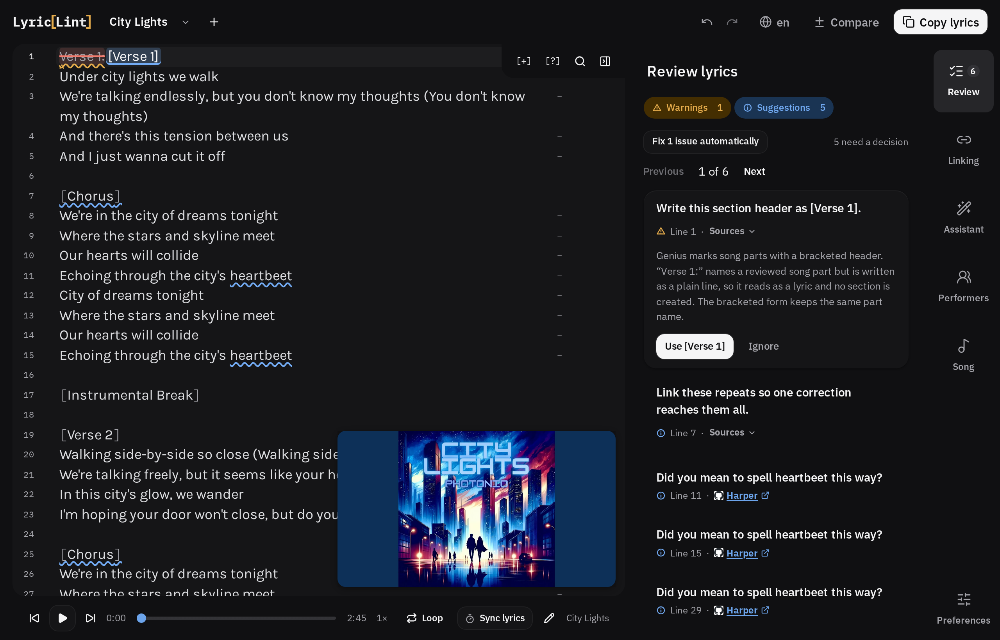

# LyricLint

A browser-based editor and linter for [Genius](https://genius.com/) lyric
transcriptions. Paste a transcription, see every formatting problem with the
Genius guideline that backs it, and copy clean markup back out.

[**Open LyricLint**](https://lyriclint.com/lint/) ·
[Browse the rules](https://lyriclint.com/rules/) ·
[Rule catalog](docs/rules.md)



Transcribing for Genius means getting a pile of conventions right by hand —
bracketed section headers, performer markup in literal HTML, ad-libs in
parentheses, curly apostrophes, unknown lyrics as `[?]`. LyricLint knows the
conventions so you can spend your attention on the song.

## What it does

### Every finding cites the guideline behind it

Diagnostics are grouped by severity and sorted so the ones worth fixing lead.
Each one carries the Genius guideline it comes from, as a link — so a finding
you disagree with is one you can go and check rather than one you have to take
on faith. Rules that are judgment calls say so, and offer no automatic fix.

Selecting a finding previews its fix **in the document, as a diff**: the text it
would drop stays put, struck through, with the replacement beside it. Nothing is
hidden and nothing is applied until you press the fix. Where a change repeats,
one press fixes every occurrence of it, and the panel can apply every safe fix
at once.

### Credit a voice by selecting it, not by writing the HTML

Performer markup is the part that costs the most and goes wrong the most: it is
literal HTML, it has to be balanced, the style slots have to be used in a
consistent order, and the section header's legend has to agree with every span
underneath it.

LyricLint does it as a selection. Select the words, choose the voice, and the
wrapper, the slot, and the header legend are written together as one edit you
can undo in one press. Two performers singing the same passage is one more
press, not a different workflow.


Every performer keeps a colour so you can see who sings each passage at a
glance — and **the colour is display only.** It never reaches the markup you copy
out, which stays exactly what Genius expects.

### Grammar and spelling, on your device

[Harper](https://writewithharper.com/) runs beside the Genius rules as a local
proofreader — no network, no account. Its findings arrive as ordinary
diagnostics, and where a reviewed rule already covers a token, the reviewed one
wins, so the panel never argues with itself.


### Transcribe against the audio

Attach a local audio file, a YouTube video, or an Apple Music song, and the
transport sits under the document — where it is operated by keyboard rather than
looked at:

- `F7` / `F8` / `F9` — back, play/pause, forward, with `Ctrl`+`Alt`+`J`/`K`/`L`
  as a fallback on keyboards without media keys.
- A resume backs up two seconds, because the words either side of a pause are
  the hardest to place.
- Playback below 1× preserves pitch, because those are the speeds a transcriber
  actually reaches for.

**Sync mode** times the lines: press play and tap `Space` at the start of each
line while the caret walks down the document ahead of you. Once lines are timed,
back and forward step between them instead of nudging by seconds, and pressing a
timestamp jumps the audio there.

### Headers in the language you are transcribing

Section headers are checked against reviewed vocabulary for English, Norwegian,
Arabic, German, Spanish, French, Japanese, and Korean — so `[Refreng]` and
`[코러스]` are both recognised as a chorus.

**A repeated chorus can be linked** so a fix lands in every copy at once, while
the words the copies genuinely differ on stay different — named explicitly
rather than quietly overwritten.

### Local first

- Transcriptions are stored in your browser and never sent to a LyricLint
  server. There is no account, and drafts have no backend.
- The workbench keeps working offline once it has loaded, and installs as an
  app.
- Two things contact a third party, each only when you ask: attaching audio
  from YouTube, Spotify, or Apple Music loads that provider's player per
  session; and the optional **rules assistant** sends the question you type
  into it (never your draft) to LyricLint's answering service, which forwards
  it to OpenAI through Cloudflare AI Gateway. Conversations are stored in your
  browser only — see [/privacy/](https://lyriclint.com/privacy/).
- `Delete all local data` in the Tools panel means it — drafts and assistant
  chats alike.

## Development

[Bun](https://bun.sh/) is required.

```sh
bun install
bun run dev
```

Run the project checks with:

```sh
bun run check
bun run lint
bun run test:unit -- --run
```

Create a production build with:

```sh
bun run build
```

### Product shots

The screenshots and the loop above are generated by driving the real workbench in
a real browser, so they cannot drift from the product as a severity colour or a
card's shape moves. Against a running dev server:

```sh
bun run render:workbench             # the hero shot
bun run render:motion                # the performer loop (webm + gif)
bun run render:motion --harper       # the grammar loop (webm + gif)
```

The transcription in every one of them is invented line by line: a product shot
of a lyric linter is the one screenshot that must not contain a real
transcription, because it ships in the bundle and on every social card.

## Documentation

- [`docs/rules.md`](docs/rules.md) — the rule catalog and the sources behind it
- [`docs/architecture.md`](docs/architecture.md) — how the pieces fit together
- [`docs/performer-tagging.md`](docs/performer-tagging.md) — the markup model
- [`docs/roadmap.md`](docs/roadmap.md) — what is planned
- [`AGENTS.md`](AGENTS.md) — conventions for working in this repository

## Security

Report vulnerabilities privately as described in [SECURITY.md](SECURITY.md).
