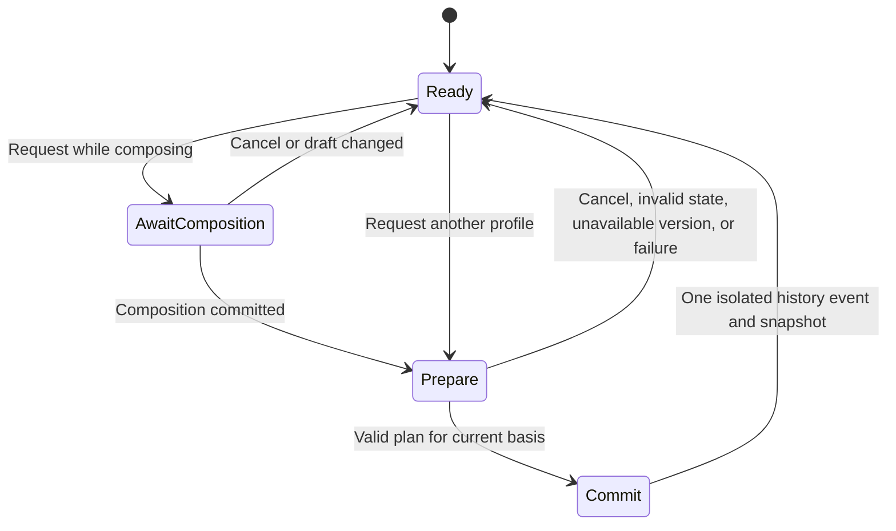

# Platform conversion: implementation specification

Status: implemented in the working tree, September 16, 2026; final release validation is in
progress. This document records the current implementation and its acceptance requirements;
it does not claim a production deployment. Read the [product guarantees](platform-conversion-plan.md) first.
The [UI specification](platform-conversion-ui.md) defines the controls and user journeys.
All eight reviewed languages remain required for the first complete release.
The [guideline comparison](platform-guidelines-comparison.md) supplies the source evidence,
language qualifications and unresolved decisions behind the policy work below.

### Implementation status and policy limits

| Area | Current implementation | Verification or remaining limit |
| --- | --- | --- |
| Profile policy | `profiles/coverage.ts` contains all 111 comparison claims; 26 independent `mxm.*` checks and 22 provenance records cover their deterministic text subsets | Every claim retains language scope, handling and its unverified remainder; a linked check does not certify the whole claim |
| Lossless editing | `conversion/` owns exact shared content, retained syntax, mapped records, authored forms and pure projections; CodeMirror effects own atomic history | Real-editor fixtures exercise 100 unchanged switches and edited/reloaded round trips; release-wide suites still gate completion |
| Automatic representation | Recognized Genius headers/annotation/voice delimiters are retained separately; eligible French pre-question spacing and Japanese mark widths share lint/conversion predicates | Case, terminal punctuation, dialect, unknown lyrics and ambiguous numeric text are not silently rewritten |
| Explicit facts | `profiles/decisions.ts` validates ordinary-cardinal quantity roles and recording-bound instrumental intervals; `conversion/facts.ts` commits the resulting facts/forms/markers | Quantity value alone is insufficient. Arabic/Korean numeric source gaps, Spanish contextual exceptions, Japanese readings and Japanese instrumental spacing require review |
| Structure and links | Stable section IDs, explicit tag selection, performer assignments and retained details; Musixmatch Linking uses the established aligner only on an explicit action | Native Musixmatch submission/tag transfer remains unavailable; plain-text copy cannot carry its native tags |
| Persistence | Versioned envelope, recovery checkpoint, `.lls`, backup and supported carrying clipboard preserve rich state | Missing versions and malformed metadata refuse rich writes; saved visible text remains recoverable |
| Reference and assistant | Dedicated Musixmatch guide, all claims/check pages, independent corpus, profile/version/hash allowlist and local proposal scope | Historical messages retain their profile. Header-addressed assistant link tools remain Genius-only; conversion never calls the assistant |
| Release compatibility | Site manifest advertises both profile corpora; preparation and health checks preserve current and exact previous-live artifacts | No deployment has been performed by this implementation task |

The remaining release gates are the complete local CI chain, production/offline scenarios and
recorded performance evidence. Unresolved source questions are explicit policy limits, not
implemented automatic conversions. They must never be represented as verified compliance.

## 1. Decisions to implement

| Question | Decision |
| --- | --- |
| What does real time mean? | Switching immediately renders the selected format; committed edits immediately update shared content and current checks. Typing never starts an automatic correction loop. |
| What changes automatically? | Reviewed representation conversions with satisfied preconditions. A diagnostic's `safe` fix classification alone never authorizes conversion. |
| What is authoritative? | One shared content string and its structured records, committed with the active editor projection. Other-format strings are disposable render results. |
| What happens to an exception? | An unchanged authored form wins over regeneration. A separate explicit correction changes it. |
| What happens to uncertainty? | Preserve wording and known facts; produce a scoped decision with concrete actions. Uncertainty need not block the entire format switch. |
| What blocks a switch? | Invalid state, unavailable required converter/version, exceeded deterministic limits, or failure to build a complete valid projection. |
| Does a switch create another draft? | No. It is one isolated undo event in the current draft. |
| Does a switch copy or submit anything? | No. Copy lyrics reads the committed active text when pressed. |
| What is the default? | New and legacy drafts start in Genius. A saved rich draft restores its selected format. |

Keep these three operations distinct:

1. **Convert representation:** a format switch, using only conversion-authorized operations.
2. **Correct lyrics:** a user applies a diagnostic fix to active text.
3. **Resolve a decision:** a user supplies a missing fact or chooses a representation. Store
   the choice with its dependencies and apply its precise effects in one transaction.

Ignoring a finding does not provide a fact to the converter. For example, ignoring a number
warning does not establish that the words are a quantity. An explicit `Keep this wording`
decision is a representation choice; accepting a band name is a scoped semantic fact.

## 2. Core representation

Use a flat shared content string and stable-ID ranged records. Reuse `TextRange`, `TextEdit`,
the lossless syntax recognizers, and existing change mapping. Do not introduce a character
rope, normalized lyric AST, or separate mutable text for each platform.

### Stored records

| Record | Owns | Does not own |
| --- | --- | --- |
| Shared content | Exact lyric text, whitespace, line breaks, and uninterpreted literal input | Recognized platform syntax extracted into records |
| Content owner | Stable ID, shared range, local revision; boundaries for independently retained text forms | An inferred meaning for every word |
| Physical lyric line | Stable ID, shared content range and optional timing | Musical section identity |
| Section | Stable ID, ordered start boundary, original labels, confirmed profile types, explicit-empty state | A required visible header or line break in every projection |
| Wrapper | Stable ID, content range, exact opening/closing literals, profile, annotation or voice reference | A copied snapshot of the words inside it |
| Layout/marker | Stable ID, anchor/range, exact source literal and applicable profile | Permission to remove ambiguous sung text |
| Authored form | Profile, owner/range, exact replacement text, precise owner/fact dependencies | A whole-song alternate snapshot |
| Voice assignment | Known performer IDs or section-scoped anonymous voice ID, assigned range/group | A global person named “Unknown voice” |
| Link group | Stable section/occurrence references, shared passages and exclusions | Membership discovered by conversion-time text similarity |
| Decision | Policy compatibility version, affected owner/fact revisions, chosen answer | A global override based on an ignored warning |

These are concepts for small typed records in `conversion/model.ts`, not separate services.
Use an ordered array where order matters. Validate duplicate IDs, dangling references, invalid
ranges, impossible nesting, and incompatible versions at every rich-data boundary.

The performer roster remains authoritative on `DraftRecord`; identity changes commit with the
model using atomic performer-history deltas. The rich document's authoritative default language
is `ConversionDocument.defaultLanguage`. `DraftRecord.language` is its compatibility copy,
updated from the committed envelope. They are not two independently mutable language settings.
Language overrides belong to mapped content ranges.

Store `contentKind: 'original' | 'translation' | 'romanization' | 'unknown'` once in the versioned
model. Legacy drafts start at `unknown`; locale, script and header spelling cannot establish it.
Changing this fact invalidates dependent policy decisions without translating or rewriting the
active text. Its policy scope matters for Norwegian translation guidance, Korean header rules
and Musixmatch's native-script/romanization workflows.

Formatted stanza boundaries and musical section tags remain distinct. Blank-line grouping may
create provisional layout groups, but does not confirm a musical identity or a one-to-one
stanza/tag relationship. Enforcing the ten-line stanza limit must not manufacture section tags.

### Exact syntax without stale lyric copies

Extract a recognized standalone Genius header as its entire physical line, including leading
and trailing spaces and its following LF if present. Its record never absorbs the preceding
separator or an additional blank line. For example:

```text
Genius:         [Verse]\n\nHi\n[Chorus]
Shared content: \nHi\n
Header records: "[Verse]\n" at 0; "[Chorus]" at EOF
```

Returning to Genius reconstructs that working text exactly. Removing surplus blank lines for
another profile is a separate reviewed layout conversion with its own retained form.

An annotation `[moon](123456)` stores the opening/closing literals independently of `moon`.
Changing `moon` to `stars` in Musixmatch produces `[stars](123456)` on returning, provided the
same owned range survives. Exact supported nesting and wrapper ordering are retained. Merely
changing enclosed lyrics must not discard original wrappers or restore old words.

Unknown/malformed syntax stays literal. On a completed edit, promote syntax into records only
when the active profile recognizes it and reconstruction still equals the exact input. In
Musixmatch, literal `[Chorus]` does not become a Genius section without an explicit interpretation
action. One profile-aware parse/classification owner must serve linting, sync, timestamps,
section controls, and `parsedDocumentForState`; raw Genius parsing cannot remain their fallback.

Working text already normalizes CRLF/CR to LF in `prepareInitialDocument`. Exactness starts
after that existing boundary; preserve `originalText` according to its existing import contract.
Never normalize Unicode or rewrite original import bytes as a side effect of conversion.

### IDs, revisions, and authored forms

- Allocate document-local IDs in source/operation order at import, edits, and explicit decisions.
  Rendering and unchanged switching allocate none. Same-position records carry explicit order;
  object iteration and UI labels never decide nesting or section order.
- Keep a persisted allocator high-water mark. Undo restores content and records but does not
  lower that mark. Branching after undo cannot reuse an ID still referenced by history.
- Local owner revisions invalidate only dependent forms/facts. Changing a verse does not
  invalidate an untouched chorus. A wrapper depends on its attachment and metadata, separately
  from a lexical form's dependence on its words.
- A form covering edited text becomes stale even if the new text looks similar. Editing a digit
  inside a rendered number materializes the whole transformed unit, preserving the exact result.
  Reuse a semantic interpretation only when its reviewed recognizer proves it still applies.
- Capture authored forms only at import, deliberate edits/corrections, or explicit `Keep this
  wording` decisions. Renderer-produced forms remain disposable derived data. Merely viewing a
  converted spelling cannot freeze it as a user-authored exception. Language/policy changes
  invalidate derived eligibility while preserving deliberate authored text until an explicit
  correction or scoped regeneration changes it.
- Bound live alternate forms to current owners/profiles. Repeated switches add no history-like
  log to the persisted model. Actual undo history retains its own inverse state in memory.
- The editor's monotonic revision validates text, durable metadata, language, profile and history
  actions; selection-only changes do not increment it. Assistant proposals also capture a
  controller profile session, incremented on actual profile transitions and editor replacement,
  plus draft identity and text anchors. Returning to identical text/profile cannot revive an old
  proposal. Owner revisions invalidate only their own stored forms/facts.

## 3. Pure API and ownership

The implemented boundary uses complete immutable document/projection results, with typed
refusals. CodeMirror owns inverse effects and operation revision checks; the pure core does not
receive UI session IDs or return an independently mutable list of pending model operations.

```ts
type ProfileId = 'genius' | 'musixmatch';

type EngineResult<T> =
	| { ok: true; value: T }
	| { ok: false; refusal: EngineRefusal };

interface ReconciledDocument {
	document: ConversionDocument;
	projection: Projection;
	changes: TextEdit[]; // Active projection edits, including mirrored peers.
}

declare function importDocument(input: ImportInput): EngineResult<ConversionDocument>;
declare function renderProfile(document: ConversionDocument, profile: ProfileId): EngineResult<Projection>;
declare function planProfileSwitch(document: ConversionDocument, request: SwitchRequest): EngineResult<SwitchPlan>;
declare function reconcileEdit(document: ConversionDocument, projection: Projection, edit: CommittedEdit): EngineResult<ReconciledDocument>;
declare function resolveDecision(document: ConversionDocument, projection: Projection, action: ConversionAction, context?: { performers: readonly PerformerRecord[] }): EngineResult<ReconciledDocument>;
declare function validateModel(document: unknown): EngineResult<ConversionDocument>;
```

`Projection` contains exact text, ordered mapping segments, derived editor metadata, and review
findings. A plan result is either a complete validated plan or a typed refusal. It is never a
partial replacement to apply before later work succeeds. Editor dispatch validates the current
revision; the pure action also checks that its supplied projection belongs to the current model.
Expected invalid/unsupported input returns a result, not an exception from a Svelte callback.
Refusal codes distinguish invalid input, stale basis, unsupported version, unavailable capability,
operation limit, and invariant failure; presentation supplies precise actionable wording.
Assistant proposals additionally capture the draft/profile/session scope. A proposal from an
earlier opening of the same draft cannot become valid merely because its wording recurs.

| Current owner | Responsibility |
| --- | --- |
| `profiles/types.ts`, `profiles/versions.ts`, `rules/registry.ts` | Two allowlisted profiles, pinned policies, independent rule registries |
| `conversion/model.ts`, `validation.ts` | Plain serializable records, invariants, deterministic identity allocation |
| `conversion/import.ts` | Profile-explicit import and legacy model construction using shared syntax recognizers |
| `conversion/projection.ts`, `profiles/representation.ts` | Rendered text, ordered mappings, exact supported syntax reconstruction and reviewed typography |
| `conversion/reconcile.ts` | Map committed edits, ownership, record attachment and alternate-form invalidation |
| `conversion/plan.ts`, `decisions.ts`, `facts.ts`, `links.ts` | Pure view switching, explicit structural/fact/link choices and typed refusals |
| `rules/` and existing policy-case owners | Shared factual predicates and reviewed edit primitives used by lint and conversion |
| `editor/extensions/conversion-state.ts` | CodeMirror model state/effects and history integration; no policy decisions |
| `persistence/conversion.ts` | Envelope validation/migration and snapshot serialization using core validators |

Create modules when their slice needs them. Do not prebuild a plugin system or one file per
record. Core modules cannot import CodeMirror, Svelte, network APIs, clocks, or the assistant.

### Mapping contract

Visible segments partition the entire projection without gaps or overlaps. Their kind is
`copied`, `transformed`, or `generated`; retained/hidden records have a separate anchored map
entry rather than a fake nonempty lyric range. All offsets are UTF-16 code units.

Copied segments map exactly. A transformed segment maps as a whole unit for editing. A caret
strictly inside maps to the target unit's end for forward/neutral affinity and its start for
backward affinity. A nonempty selection intersecting that unit covers the whole corresponding
target unit, retaining selection direction. There is no proportional letter-to-digit mapping.
Generated header/wrapper edits belong to their structural record. A selection spanning
several segments maps each part before its enclosing operation is classified.

Automatic length-changing conversion also requires valid metadata mapping. Every annotation,
voice, link, or language boundary intersecting the unit must enclose it completely, lie outside
it, or have an explicit reviewed finer mapping. For example, `th[ir](123456)ty` cannot become
`30` automatically: no digit corresponds to that annotation's `ir`. Leave the wording and
produce review. An edit of an already transformed unit must likewise detach a surviving detail
that no longer has a justified range; never snap it to a guessed digit.

At a hidden section boundary, ordinary insertion belongs to the following section; at EOF it
belongs to the final section. An explicit section command carries its chosen section ID, which
overrides that default. Existing visible syntax distinguishes typing inside and outside a
wrapper. For hidden annotation/voice ranges, insertion strictly inside extends the range;
insertion exactly at either endpoint is outside unless an explicit assignment/edit command
includes it. Store start/end affinity and test both directions.

All editor selection ranges map independently, retaining the main selection index and direction.
If a range becomes wholly hidden, collapse it at its owning boundary, then the nearest surviving
boundary in document order if the owner was removed. Use document start only when none survives.
Do not search lyrics to recover selections. Preserve the mapped first visible passage and its
relative viewport position after widget layout settles.

## 4. Transactions and reconciliation

### Ordinary committed edits

1. Read the active projection and actual ordered CodeMirror changes, including their base epoch.
2. Classify/map the source changes into owned shared operations, materializing any touched
   transformed unit while preserving its exact edited text.
3. Expand stored linked-passage targets in shared coordinates through the sole `passageTargets`
   planner, then build source and peer view changes for one final transaction.
4. Preserve line/owner identities where the specified edit semantics permit it; allocate only
   genuinely new occurrences. Invalidate dependent forms and facts.
5. Reparse the affected syntax with the active profile. The active result must equal the user's
   exact committed text, including any deliberate malformed syntax.
6. Validate and commit model, projection, selection and metadata in the same CodeMirror state.
   Publish one durable snapshot; current-profile checks derive from it.

Adapt ordinary header/roster behavior to that pipeline rather than running an independent
pre-reconciliation mirror. Refactor passage ownership to stable section IDs: two hidden sections
can share a position, so fabricated header coordinates cannot substitute for identity. Reconcile
the combined model operations once. A private projection transaction bypasses ordinary-edit
paths and carries already validated effects and rebuilt view coordinates. It cannot trigger a
second link mirror or infer roster changes from rendered text.

IME text is a transient CodeMirror composition overlay on the last committed model. Accumulate
the composition changes and reconcile once after the existing composition lifecycle commits.
During preedit, map settled decorations but do not apply fixes, convert, or publish preedit as a
durable converted model. Browser composition timing is presentation behavior, not policy input.

Keep `AtomicDocumentEdit` strict: it remains a nonempty text edit. Add a distinct validated
model transaction carrying model effects and optional text changes for switches, metadata-only
actions, and decisions. Do not fabricate an empty text change to bypass its validator.

### Required structural outcomes

| Operation | Outcome |
| --- | --- |
| Whole-line rewrite with the line retained | Keep line ID and time, matching `rescueRewrittenLines` |
| Split a line | Old ID/time follows earliest fragment containing surviving original lyric text; new fragments are untimed |
| Insert newline at column zero | New empty prefix gets a new ID and no timing; original lyric fragment keeps its time |
| Merge lines | Keep the surviving identity and earlier time; other timing is restored only by undo |
| Delete an owner completely | Retire its live attachments; no hidden lyric copy can reappear on switching |
| Replace across several owners | Keep only exactly mapped attachments; unresolved surviving records require explicit placement |
| Edit enclosed annotation text | Preserve wrapper literals/ID while a valid owned range remains |
| Explicitly remove both sides of an annotation/style wrapper, keeping its words | Retire that wrapper/assignment representation as appropriate to the command; keep lyric text; do not reconstruct the removed syntax on switching |
| Break only part of a wrapper while typing | Keep exact incomplete source syntax and recoverable ownership; do not hide the broken bytes or invent a repaired wrapper |
| Create crossing wrappers that the target cannot express | Keep exact active input; retain unrenderable wrapper metadata and issue a placement/representation decision; never reorder words |
| Remove full Genius header | Remove that boundary under existing Genius ownership behavior; keep lyrics, do not resurrect the header; reassess affected links/voice representation |
| Partially break a header delimiter | Preserve literal recoverable input and surviving section ownership; do not interpret as deliberate boundary removal |
| Delete a body while a section control remains | Keep an explicit empty section |
| Two originally empty sections share one boundary | Keep their ordered identities; this is valid, including at EOF |
| An edit collapses distinct nonempty boundaries or leaves one mid-line | Preserve text and records, mark placement unresolved; no automatic newlines or section merging |
| Remove a section boundary through controls | Keep lyric text; preview conflicting labels/assignments before an explicit merge decision |
| Delete section and lyrics | Remove the chosen section and body together; retire live attachments; one undo restores all |
| Clear entire draft | Remove content and retained records together through a separate explicit command |

Annotations cannot migrate to an identical repeated phrase. Copy/paste allocates new occurrence
IDs; rich metadata may recreate relationships only after validation. A repeat-expansion action,
if a reviewed policy supports it, likewise creates new untimed occurrences rather than inventing
audio times or links.

### Switching state machine



Preparation may load local modules; it does not change the committed profile. Keep one pending
target. A newer request replaces it; requesting the committed profile cancels it. Escape cancels
a pending request owned by the format control, after any more local transient surface dismisses.
On module completion, plan from the latest committed state. Never commit a plan whose basis is
stale. Draft change, destruction, or explicit cancellation invalidates outstanding work.

Typing remains available while modules load. Warm planning is synchronous initially. Any later
worker implementation must use the same pure API and stale-result rejection. A checker failure
after a successful switch changes check availability, not the accepted text/profile.

### History and snapshots

Use `isolateHistory.of('full')` for a switch and `invertedEffects` for its model/metadata changes.
Redo uses stored effects; it does not invoke a newer converter. The existing section-link history
is a starting point. Line anchors currently have no equivalent complete inversion support;
implement and test timing inversion rather than assuming ordinary text history preserves it.

Extend `editorRevisionField` or introduce its single replacement to cover actionable model and
profile changes. Extend `update-bridge.ts` to publish effect-only durable changes. Context,
diagnostic display, and callback effects must not trigger feedback loops or autosave by themselves.

History restores authored state exactly. The allocator high-water mark and session epoch remain
monotonic, so tests compare authored state separately from those control counters. History stays
session-local; save/reload restores the document, not an unpromised persistent undo stack.

## 5. Policy, language, and diagnostic contracts

Extend existing sources, guidance and `RulePolicyCase` ownership with one conversion inventory.
It references those records instead of duplicating the conventions. Each atomic claim has:

- Stable ID, compatibility version, platform, paraphrased statement, exact source locator,
  retrieval/verification date, evidence fingerprint, and reviewed interpretation.
- One explicit coverage row for each applicable release language and both directions.
- Independent dimensions: deterministic check coverage, diagnostic fix kind, switch operation,
  required facts/exclusions, manual/audio requirements, fixture IDs, remaining implementation.

`manual`, `not-applicable`, and `unavailable` require a substantive reason. Unfinished work on an
applicable deterministic conversion blocks release; it cannot be relabeled an unsupported case.
Automatic operations need independently written positive, excluded, ambiguous, reverse, and
edited-round-trip cases. Structural operations may share helpers across languages; coverage
still names `en`, `no`, `ar`, `de`, `es`, `fr`, `ja`, and `ko` explicitly.

Source origin and platform standing are separate fields. Genius keeps its staff/editorial/
community distinctions; official Musixmatch guidance has official standing for Musixmatch.
LyricLint interpretations and language dictionaries remain visibly distinct from platform policy.

Use the comparison's planning claim IDs to trace production cases back to evidence. Review the
decision register before authorizing affected operations: a named language qualification can
narrow a general rule, but source recency alone cannot resolve a conflict. An unresolved source
conflict preserves the authored form and reports its precise scope; it does not create two
opposing fixes or silently select a winner. Language, content kind and applicable supplied facts
are part of policy eligibility and cache/decision dependencies.

### Language-dependent behavior

Keep the full selected locale in document state and all relevant keys; use the base tag only to
select a reviewed pack. Draft language is the default. Explicit passage overrides take priority;
an unreviewed override permits only applicable language-independent work. Never fall back to the
draft's language to rewrite that passage. A token crossing different language assignments is not
automatically rewritten.

Changing language reruns checks and invalidates dependent decisions/caches, but preserves active
text. Preserve an existing authored target form until an explicit fix or scoped regeneration
decision changes it. Language detection proposes a choice only.

Existing header packs are evidence about Genius vocabulary, not complete conversion policies:

| Language | Required policy/fixture work before declaring full support |
| --- | --- |
| English | Regional spelling, contextual slang, quantity/name/time/date/identifier distinctions; preserve unresolved words while reporting the explicit MXM placeholder prohibition |
| Norwegian | Preserve sung dialect; Bokmål preference applies to translations. `Refreng` remains Chorus/Refrain ambiguous; review number morphology and lyricless-joik workflow |
| Arabic | Dedicated-source gap remains. Review numeric/script scope, RTL logical offsets, mixed Latin/Arabic text and digit sets, combining marks |
| German | Borrowed-word casing, contextual apostrophe/dialect variants and compound numbers; `Part`/`Hook` retain Genius-specific interpretations; extended supplement is not official policy |
| Spanish | Direct-speech colon and quotation roles, elision/accents, lead/background/live roles, numeric exceptions; establish the 70-character counting metric |
| French | Restrictions on exclamation marks/colons/semicolons, question-mark spacing, elisions, fixed numeric expressions and unresolved time wording |
| Japanese | Width-sensitive marks, script/readings, contextual vocables and ambiguous tag mappings; resolve instrumental spacing and parenthetical-case scope |
| Korean | Dedicated-source gap remains. Review Hangul/Latin mixtures and numeric forms; header language does not establish original/translation status |

This table scopes implementation and fixtures from the comparison's evidence. The production
inventory is `profiles/coverage.ts`, which registers language scope and a precise remaining limit
for every clause. Linked romanization and tagging sources have been read. Arabic/Korean
dedicated policy, exact romanization eligibility, conflicting examples and native handoff remain
evidence limits; text checks do not turn them into verified conversions.

### Finding identity and actions

Use `(profile, policyCompatibilityVersion, findingCode, ownerId, discriminator)` as structured
occurrence identity, also including the stable policy/rule ID. Location and wording are display
data. Existing public Genius rule IDs remain stable. Findings found by both conversion and lint
share one policy owner and one emitted occurrence.

Preserve the existing native/Harper reading order. Add metadata locations without inventing
line zero or a text range. Shared diagnostic components render location and finite typed actions:
`chooseSectionType`, `placeBoundary`, `assignVoice`, `attachDetail`, `confirmFact`, `keepForm`,
and `removeDetail`. Every action validates its operation basis and current dependencies.

The implemented fact actions are `confirmQuantity` and `confirmInstrumentalInterval`, owned by
reviewed policy cases rather than an arbitrary key/value payload. Quantity records bind an owned
unit and exact parsed integer string to role/pronunciation and chosen forms. Names, identifiers,
fixed expressions and time/date/phone/decade roles explicitly refuse the ordinary-quantity action;
they retain text or an explicit authored-form choice, not a fabricated semantic proof.
Intervals bind finite nonnegative start/end, adjacent section IDs, explicit no-lyrical-content
confirmation and the current recording reference. Each case validates its required evidence and exclusions.
The interval must meet the reviewed duration/placement rules before a marker is offered; a
line-start gap is never substituted for its end evidence. Vocalizations/joik may require a
separate reviewed classification, and confirmed timing cannot resolve a source-policy conflict.
If its referenced recording changes,
the fact needs reconfirmation. Confirming an interval does not create lyric timing anchors.
Further fact kinds require their own schema, sourced policy case, UI and fixtures.
Confirming a numeric value also does not override fixed-expression, time, name or pronunciation
exclusions; the full reviewed context predicate must still hold before conversion.

Legacy ignores are Genius-only. Match them against unchanged Genius text with the existing
matcher, then bind resolvable occurrences to stable owners. Preserve unmatched records as legacy
restorable choices. Never rematch them against Musixmatch. Keep absent/inactive-profile choices;
ordinary checks do not delete them. A changed semantic question requires a new compatibility
identity, while an unrelated ruleset bump does not erase every acceptance.

Update `diagnostics/order.ts`, `diagnostics/ignore.ts`, `rules/results.ts`, spelling caches,
Harper configuration, `Workspace.svelte` lint keys and initialization. Use declared ordering and
code-unit comparison for identifiers, not `localeCompare` or message text to decide edit winners.
Conversion conflicts apply neither candidate unless an explicit shared owner/subsumption resolves
them. Existing deliberate Fix all arbitration is a separate contract and must remain explicit.

## 6. Persistence, import, and recovery

Store a versioned `DraftRecord.conversion` envelope containing active profile, model, pinned
converter/policy versions, and active-projection integrity data. `DraftRecord.text` is the exact
committed recovery snapshot. The top-level roster, compatibility language copy and the envelope
are one save unit; the model's `defaultLanguage` is authoritative for rich documents.
Validate equality with the reconstructed active projection whenever the pinned renderer exists.
A checksum helps detect mismatch; it does not replace structural validation.

Rich records own timings/links inside stable model records. Old line-number `lineAnchors` and
header-line `sectionLinks` are migration inputs, not independent rich-state authorities. Derive
view-coordinate snapshots for existing editor consumers. After successful migration, rich writes
omit the legacy timing/link siblings; do not maintain two mutable representations of them.
Audit every direct reader as well as every copier before enabling this storage path.

The concrete starting database is schema 5. Introduce schema 6 (or the next free version when
implemented) as the old-writer barrier. Handle `versionchange`, blocked upgrades, and pending
edits before enabling rich writes. An old connection must close for the upgrade to complete;
do not bypass the database version merely to make switching available.

Also add a persisted storage generation and atomic compare-and-save for current-version tabs.
The save queue serializes per draft and compares the expected generation inside its write
transaction. A conflict preserves the local snapshot as a separate recoverable draft and leaves
the newer stored original intact. Create that fork with its applicable local ignored choices
and media attachment reference in the same database transaction, preserving the original side
records. Move the current-draft pointer only after successful creation, then announce the saved
copy and continue there. Existing row-only duplication is insufficient for this operation.
If the fork also fails to save, retain the complete state in memory and offer export without
claiming it was saved. Never merge lyrics by wall-clock order. `updatedAt` remains presentation
data, not conflict arbitration.

Migration is pure and preserves legacy Genius text. Validate the entire result before replacing
the old record in an atomic save. Update `copySnapshot`, `copyDraft`, `createRecord`, `writeRecord`,
shared copy helpers, duplicate/startup recovery, backups, `.lls` in `scribe/format.ts`, clipboard,
and the actual export/import paths in `workbench.svelte.ts`. Metadata-only drafts must survive
all empty-draft cleanup paths. A profile choice alone on a truly empty draft need not create a
saved draft; it is retained by the in-session editor until content/other deliberate work exists.

### Import and output decisions

| Boundary | Behavior |
| --- | --- |
| Legacy draft / `.lls` | Import as exact Genius working text, deterministically build model |
| New rich `.lls` / backup | Validate declared schema, model, versions and projection before any mutation; restore saved profile |
| Plain-text file | Source-format field defaults to current profile; opening preserves that source text; switching afterward uses the normal converter |
| Ordinary paste | Exact insertion in active format; no profile guessing or silent stripping |
| Valid rich clipboard data | Keep plain text exact; attach only validated compatible metadata, remapping copied occurrence IDs |
| Foreign-profile rich clipboard | Preserve pasted text; expose explicit interpretation/conversion before applying incompatible syntax records |
| Explicit Interpret as Genius/Musixmatch formatting | Preview selected input's named source parse and target projection; commit through normal model/history validation |
| `.txt` / Copy lyrics | Exact active text, without an export-only correction pass |
| `.lls` / backup | Complete model, versions, decisions, retained details and selected profile |

Rich clipboard never includes hidden details outside the selected ownership scope. Partial
annotation copies do not acquire a complete annotation ID unless the existing reviewed clipboard
contract permits that exact range. Unsupported optional metadata is ignored using the existing
partial-recovery rules; invalid rich project files fail before mutation.

### Failure behavior

| Failure | Preserve and expose |
| --- | --- |
| Conversion or validation refusal | Previous committed profile/text/model/history unchanged; typed reason and Retry where executable |
| Save quota/write failure | Current in-memory state and pending save intact; existing save-failure feedback; full project export remains available |
| Corrupt rich record | Raw original record untouched; recover exact saved text as a separate draft, with retained data available for recovery/export |
| Required old converter absent | Exact saved text/data readable and exportable; conversion unavailable until a supported migration, with no latest-version fallback |
| Unexpected reconciliation invariant failure | Preserve latest visible input in a separate recovery state and keep the last valid rich checkpoint; stop conversion/fixes against mismatched maps, announce the failure |
| Unsupported import version | Refuse before creating/replacing a draft; never silently import only the visible text from that rich file |

Recovery state is an explicit alternate record kind with exact text and an immutable prior
checkpoint. It does not pretend that stale model coordinates describe the recovery text. Plain
editing/copy remains possible there; restoring rich associations requires a validated recovery
operation. No recovery path may silently reintroduce lyrics deliberately deleted earlier.

## 7. Reference, assistant, and offline integration

Canonical Genius reference routes are `/guidelines/` and `/guidelines/checks/<rule>/`; `/rules/`
routes are compatibility redirects. Musixmatch uses `/guidelines/musixmatch/` and its topic
routes; `?profile=musixmatch` is a compatible entry that selects that directory. Namespaced
`mxm.*` checks retain the common check route and select the corresponding finder. Static route data contains both reviewed profile corpora
without depending on a server reading a query string during prerendering. Explicitly unsupported
profile/check combinations show the mismatch and the valid destination, not another policy's prose.
Preserve legacy Genius fragments and redirects. Search, counts, sources, tables and citations
derive from the same selected manifest as the workbench.

Assistant requests select a server-allowlisted `(profile, rulesetVersion, corpusHash)`. Historical
messages keep their original profile; old requests without a profile map only to supported legacy
Genius corpora. All proposals carry the current operation basis. Header-line link tools require
stable section references in Musixmatch; unavailable actions are withheld until implemented.
Assistant output never supplies an automatic conversion fact.

Bundle both converters and reviewed policies as versioned local assets. Preserve service-worker
upgrade behavior and verify offline reopening/switching after a completed installation. Do not
infer that the converter loaded successfully just because the checker did, or vice versa.

## 8. Implementation batches and acceptance

These refine the parent plan's phases into reviewable changes. Do not expose editable switching
to users until data-safety, undo, and UI integration pass together.

| Batch | Concrete work | Required evidence |
| --- | --- | --- |
| A. Reviewed inventory | Claim/coverage schema, all-eight-language rows, shared conversion/check owners, native Musixmatch tagging limits | Every planned operation has sources, exclusions and both-direction cases; unresolved research is visible |
| B. Profile isolation | Explicit profile/context/manifest, source standing, stable finding identities, stale fix/provider rejection, legacy ignore migration | Same text can yield different findings without cross-profile suppression; Genius fixtures unchanged |
| C. Lossless core | Flat content + ranged records, exact header/wrapper extraction, pure render/maps and validators | Exact round trips including nested wrappers, malformed text, explicit empty sections and metadata-only documents |
| D. Production vertical slice | Reconciliation, typed model transactions, link/timing adapters, effect-only snapshots, full inversion | Parent plan's Mira/Noor fixture switches, edits, undoes/redoes and preserves exact metadata through the actual editor |
| E. Durable model | Database barrier, generation checks, every copier, `.lls`/backup/clipboard versions, recovery union | Same fixture survives reload/duplicate/export/import; old and current stale writers cannot erase it |
| F. Complete editor surfaces | Format control, Sections/retained details, typed Review decisions, phone flow, capabilities | UI acceptance in companion spec; exact copy; no inaccessible hidden-only controls |
| G. Full policy coverage | All reviewed operation families and languages, mixed-language ranges, ambiguity decisions | Inventory complete, independently authored outputs, no pending applicable language implementation |
| H. Reference and assistant | Profile-aware canonical routes/corpus/requests/proposals, output explanations | Links and answers cite the selected policy; stale tools cannot apply |
| I. Release | Updated contracts, full local CI, production/offline and performance evidence | Parent plan's complete-release guarantees plus scenarios below pass |

B can proceed beside remaining inventory authoring after its identity contracts are established.
C–E form the first end-to-end slice. Expand rule families after it proves the representation.
F and H can then use that established API; do not build separate temporary text-transform paths.

### Fixture families

Use invented lyrics and hand-written expectations. Add focused suites beside their owners,
including seeded edit sequences for the substantive mapping/history properties:

- **Content:** empty/whitespace/EOF, repeated identical lines, nested and multiline wrappers,
  incomplete syntax, selections within generated syntax, splits/merges/whole-line replacement.
- **Structure:** explicit empty vs accidentally collapsed sections, mid-line boundaries, unknown
  labels, `Hook`, German `Part`, Norwegian `Refreng`, removal and deliberate merge commands.
- **Metadata:** named/anonymous voices, fifth Genius voice group, linked variations/exclusions,
  deleted vs detached annotations, separate timestamps on identical chorus occurrences.
- **Language:** every release language in both directions, full locale keys, explicit unsupported
  passage language, code switching, RTL, surrogate pairs, combining marks and Japanese/Korean IME.
- **Lexical:** names vs quantities, leading-zero identifiers, values beyond safe integers,
  distinct decimal/date/time/ordinal recognizers, acronym punctuation, censored/unknown words,
  slang alternatives, eleven physical lyric lines versus soft wraps.
- **Lifecycle:** text-identical switch, repeated no-op switch, pending module/Harper/assistant
  result, preview invalidation, undo branching, sync, language-only changes and draft replacement.
- **Durability:** metadata-only autosave, schema barrier, same-version save conflict, quota,
  corrupt/incompatible data, missing pinned versions, `.lls`, backup and partial clipboard.

Run the focused core/component suite for each batch. At integration run `bun run test` plus the
existing production/offline and performance checks. Do not add tests that merely mirror record
fields; exercise the real copier/transaction/import path. Record the parent plan's latency and
bounded-memory evidence on the existing 80/800-line workloads.

### Remaining evidence gates

Focused core, real-editor, policy, reference, assistant, persistence and phone tests now exist;
their presence does not replace the final combined run. Complete the local CI chain and the
production/offline scenarios, and record performance on the stated workloads before release.
Core ceilings currently allow 1,000,000 UTF-16 text units, 100,000 records and 10,000 edits per
operation, with further bounds inside the shared passage aligner. Exceeding a ceiling refuses
conversion and preserves saved text. Source conflicts/gaps remain explicit review states and
native tagging handoff is not offered; no passing suite can settle those external questions.

### Final verification: bounded performance evidence

On 2026-09-16, temporary Bun scripts measured synchronous import, rendering, projected parsing,
single-character edits and Musixmatch linting against invented 100,000–1,000,000-character
documents. Each script had a 25-second external timeout. These are single-operation measurements
on the development machine while other checks were running; they establish algorithmic scaling,
not a browser-paint latency guarantee or a low-memory-device guarantee.

| Workload and operation | Before the measured fixes | After |
| --- | --- | --- |
| 100k characters, 1,086 sections and 2,172 wrappers: Musixmatch parsing | 1,532 ms | 1.9 ms |
| 100k French characters, 2,500 sections and 5,000 omitted spaces: Musixmatch parsing | Exceeded the subprocess limit | 4.6 ms |
| 1M characters, 11,111 language ranges: Genius / Musixmatch rendering | 6,115 / 6,263 ms | 24 / 46 ms |
| Same mixed-language document: Musixmatch linting | 2,131 ms | 784 ms |
| 1M characters, 10,869 sections and 21,738 wrappers: import | 7,050 ms | 788 ms |
| Same structural document: Genius / Musixmatch rendering | 3,950 / 806 ms | 163 / 196 ms |
| Same structural document: Musixmatch parsing | Exceeded the subprocess limit | 12 ms |
| 1M characters with a timestamp on every line: Genius / Musixmatch rendering | 5,476 / 5,347 ms | 29 / 31 ms |

The final structural measurements include the strengthened exact-header trust validation.
Validation still runs before rendering. Ordered owner/language and section/marker passes,
binary omission/boundary lookups, shared line indexes and indexed import replace repeated full
scans. Language-independent checks run once; language-dependent checks remain bounded by the
eight reviewed policy families and one unsupported-language family. Number review skips
expensive numeric-boundary matching on lines without digits and searches English number words
only in English scope. No source rule, boundary check or operation ceiling was weakened.

Additional boundary cases: 70,000 language ranges within approximately 92,000 model records
rendered in 252 ms and linted in 718 ms. Fifty thousand adjacent formatting wrappers imported
in 308 ms and rendered in 60 ms. A 1,000,001-unit input refused in 1 ms; 50,001 physical lines
refused in 3 ms. A new functional regression checks all omitted offsets, section identities
and exact reverse rendering for the 2,500-section French fixture; it does not assert an unstable
wall-clock threshold. The focused conversion/profile/rule run passed 156 tests, with targeted
linters clean and the application type check reporting zero errors and warnings. The combined
CI and production-browser run remains a separate final gate.

An extreme one-line input of 500,000 alternating Japanese letters and question marks creates
1,000,000 projection segments: rendering took 723 ms and parsing 49 ms. The input and retained
model remain bounded by the deterministic text/record ceilings, but derived projection segments
are temporary allocations rather than retained records. This is a substantial allocation and
is not evidence of acceptable browser memory use on low-end devices. Likewise, approximately
0.8 seconds of synchronous mixed-language lint at the text ceiling can be a noticeable UI pause.
These measurements do not claim that every ceiling-sized document meets the ordinary-document
paint target; the existing 80/800-line browser workloads remain the relevant UI evidence.
