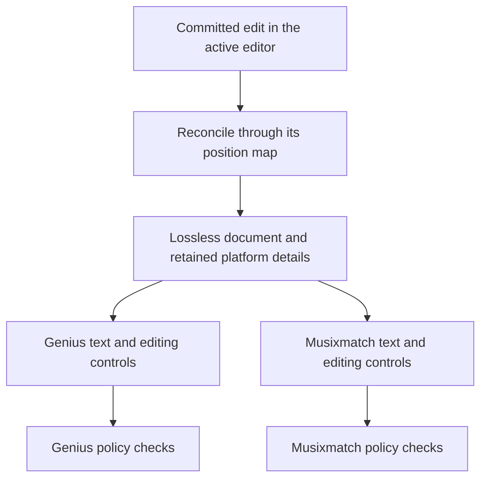

# Deterministic Genius ↔ Musixmatch engine

Status: implementation and focused verification recorded September 16, 2026; complete release
validation remains in progress. This plan establishes acceptance requirements. The
[implementation status](platform-conversion-implementation.md#implementation-status-and-policy-limits)
records the actual modules, ownership and current limits. Production deployment is separate.

Planning expanded September 16, 2026:

- [Guideline evidence and comparison](platform-guidelines-comparison.md): actual Musixmatch
  requirements, Genius differences, language qualifications, source conflicts and open decisions.
  The [source manifest](platform-guidelines-sources.json) records retrieval provenance.
- [Implementation specification](platform-conversion-implementation.md): concrete model, APIs,
  transaction order, policy coverage, storage migration, recovery, and implementation batches.
- [UI and edge cases](platform-conversion-ui.md): format picker, desktop/phone layouts, section
  and retained-detail controls, Review actions, and interaction/lexical case tables.

These companions now distinguish implemented behavior, source limits and remaining evidence
gates. Their acceptance requirements are not a claim that an unrun test or benchmark passed.

The working implementation includes exact local switching/editing, retained metadata, profile
checks/reference/assistant, persistence/recovery and desktop/phone controls. Automatic lexical
representation is deliberately narrow: French question spacing and unambiguous Japanese mark
widths. Other policy-sensitive changes use explicit previews, authored choices or validated
facts. All 111 researched claims have a coverage record; this is traceability, not a claim that
every clause can be verified from text. Arabic/Korean dedicated-source gaps, French time
ambiguity, Japanese spacing/case conflicts and native submission limits remain visible.

## Outcome and scope

One 'scribe can be edited in Genius or Musixmatch mode. Switching changes its representation,
available editing controls, diagnostic policy, and copied output. Edits made in either mode
survive the return trip, including through save/reload. Information belonging to the other
platform stays attached to the work and remains inspectable.

The engine runs locally with bundled, reviewed policies. Conversion requires no model, service,
account, network lookup, or audio analysis. Existing optional assistant functionality is outside
the conversion engine and is never an input to an automatic conversion decision.

Confirmed release scope: the user selected every currently supported language on September 15,
2026. All eight currently reviewed languages (`en`, `no`, `ar`, `de`, `es`, `fr`, `ja`, `ko`)
are required in the first complete release. The larger header inventory is not evidence of
conversion support. Each language needs an explicit policy-coverage inventory; English examples
do not authorize other languages'
number spelling, capitalization, or pronunciation. Unsupported automatic transformations retain
text and state their precise review requirement.

For each of these eight languages, release requires implementation and review of the applicable
language-specific checks and deterministic conversions in the coverage inventory. Deferred
implementation of an otherwise supported conversion is a release blocker. Genuinely ambiguous,
audio-dependent, or unsupported policy interpretations retain the explicit review behavior
defined below. Generic checks alone do not satisfy a language's release gate.

The complete release includes editable switching, diagnostic parity, persistence, recovery,
undo/redo, timings, links, performer editing, accessible desktop/phone behavior, and exact copy.
Intermediate milestones below are integration boundaries, not substitutes for that outcome.
Direct submission to either platform and automatic transcription are outside this feature.

## 1. Product guarantees

1. **Unchanged round trips are exact.** Switching A → B → A without editing restores A's exact
   editor text and metadata, including deliberate exceptions, malformed input, and annotations.
   Merely viewing B does not accept a correction to A. File line-ending behavior follows the
   existing import/export contract; the engine introduces no additional normalization.
2. **Edits survive format switches.** Editing in B updates the shared content. A's untouched
   source details survive; outdated spellings/markup at the edited location do not overwrite B's
   correction. Keeping a whole original snapshot or two independently editable strings cannot
   satisfy this guarantee.
3. **Deterministic does not mean automatically justified.** Mechanical, policy-supported
   conversions can apply on switching. Contextual cases become explicit review items. Being
   reversible is not, by itself, evidence that a rewrite is correct.
4. **No invented information.** Missing section identity, performer identity, vocal delivery,
   censored letters, pronunciation, annotation IDs, and audio durations remain unknown unless
   supplied or explicitly confirmed by the user. Text similarity cannot invent them.
5. **Typing remains typing.** Ordinary input is preserved exactly in the active view. Incomplete
   words and IME preedit never trigger normalization. Switching renders the other format;
   diagnostic fixes remain deliberate actions.
6. **The active profile is coherent.** Its text, metadata controls, findings, fixes, citations,
   reference links, and export capabilities agree. A clean lint result never claims complete
   transcription accuracy or successful submission.
7. **One transaction owns a change.** Content, mappings, profile, retained details, and affected
   editor metadata commit together. Failure leaves the preceding committed state usable.
8. **Retained information is durable and accessible.** Switching never silently deletes a
   Genius-only annotation or sound description. Hidden details can be inspected and removed
   deliberately; plain-text copy contains only the active text.

## 2. Determinism contract

For the same validated document state, explicit language, profile, policy/converter versions,
and ordered input transaction, the core must produce identical serialized output, metadata
operations, mappings, review items, and diagnostics. Selection/typing settlement is an explicit
presentation input, not a different policy answer.

- Pure TypeScript modules contain parsing, projection, reconciliation, policy, and validation.
  They do not import Svelte, CodeMirror, clocks, network APIs, or the assistant.
- Algorithmic ordering uses declared phase/rule ordering and stable IDs. No host-locale
  `localeCompare`, message wording, map iteration accident, or asynchronous completion order
  decides an edit winner. Audit `rules/results.ts` when establishing this invariant.
- Semantic decisions do not depend on language-detection scores. The selected language and any
  user-confirmed passage language are explicit inputs; unreviewed mixed-language passages get
  no automatic language-dependent rewriting.
- Conversion uses explicit locale rules and reviewed tables. Do not rely on host defaults or
  ICU-dependent number formatting. Preserve Unicode as entered; never normalize the whole
  document. Any character classification/casing used for conversion must produce the same
  results in supported runtimes, demonstrated by cross-runtime fixtures.
- Node IDs come from a persisted document-local allocator, allocated in transaction order.
  Replaying identical inputs produces identical IDs. External draft IDs and timestamps are
  envelope data, not conversion inputs. Undo must not permit IDs to be reused by a new branch.
- Work ceilings are defined by input sizes and operation counts, never an elapsed-time timeout
  that changes semantic output. An exceeded ceiling produces an explicit incomplete result.
- Cache keys include every semantic input, including profile, language, policy/converter
  versions, and relevant retained metadata. Cache hits and cold execution must agree exactly.

Harper remains an ancillary provider. Pin its version/configuration, review each profile's
dictionary, sort completed results deterministically, and reject results from a previous
revision/profile. Neither its spelling guesses nor the statistical language detector authorize
conversion. Provider availability must remain distinguishable from a successful check.

## 3. Policy inventory before implementation

The [guideline comparison](platform-guidelines-comparison.md) now inventories all six areas of
the supplied Musixmatch page, official language articles, relevant workflow sources and linked
community supplements alongside the reviewed Genius evidence. The main page was retrieved
again unchanged on September 16, 2026. This is source research, not completion of the project's
human policy review. Production entries need the same review discipline as Genius:
exact section, paraphrased claim, retrieval/verification date, evidence fingerprint, explicit
language scope, reviewed interpretation, and invented valid/invalid/ambiguous examples.

Use that inventory's claim IDs and decision register to classify each claim's support as:
automatic conversion, deterministic check with proposed fix, metadata workflow, or human/audio
verification. Every claimed supported conversion needs a rule owner and fixtures. Check coverage
and conversion coverage are separate facts. A rule checking one example is not full coverage.

### Main-page baseline and its consequences

This compact table is not every language's effective policy. The comparison records Spanish
direct-speech and line-length requirements, French punctuation/time qualifications, Japanese
width rules and source conflicts, Norwegian/German dialect guidance, and English's prohibition
on unknown-word placeholders. Arabic/Korean dedicated-source coverage remains an explicit gap.

| Area | Musixmatch policy or source limit | Engine consequence |
| --- | --- | --- |
| Structure and performers | Labels stay out of sung text; separate tagging exists | Preserve identities outside text; do not turn every Genius header into a hashtag line |
| Instrumentals | A literal `#INSTRUMENTAL` has specific interior-placement and >15-second requirements | Require supplied duration/placement evidence; never infer silence from blank lines or `[Instrumental]` alone |
| Hook | A distinct supported tag | Preserve it; Genius's existing Hook→Chorus/Refrain interpretation is not a universal equivalence |
| Numbers | Digits above ten, with time/date/phone exceptions and word-based o'clock times | Locale-aware rules; names, pronunciation, and unknown contexts require review |
| Parenthetical vocals | Capitalization follows grammar | No blanket lowercase or uppercase operation |
| Punctuation | No terminal commas/non-acronym periods; qualified other endings | Identify acronym/quotation context; do not strip all end punctuation |
| Non-vocal descriptions | Omitted | Retain recognized descriptions as platform details; ambiguous text stays visible for review |
| Censoring | Follows heard delivery, with hyphens for cutoffs | Do not manufacture missing letters from Genius masks |
| Long sections | At most ten lines per formatted section | Flag oversize sections; a musical split needs a user decision |
| Quote glyphs | Examples alone do not establish a universal curly-quote mandate | Do not create a typography requirement from their appearance |

The full comparison also inventories transcription, spelling, sync, performer, translation and
review requirements, including those that cannot be checked from text. Do not create permanent
warnings without evidence in the current draft. Format conversion cannot establish the
contributor's own listening-based transcription or verify the recording.

Instrumental evidence means an explicit or user-confirmed interval with known start/end and
no qualifying lyrical content; vocalization/joik classification may require review. Two
lyric-start timestamps do not establish that interval: the first line's end is unknown. Fixtures
must distinguish exactly 15 seconds from more than 15 and interior placement from song edges.
The main page requires a following blank line, while Japanese FAQ 7 says it is not needed:
preserve authored spacing until this conflict has a reviewed resolution. The official
romanization article has now been read, but it does not supply a complete language eligibility
list. Unestablished cases receive scoped guidance rather than a blanket rejection.

Audit current Genius behavior before sharing it. `numbers.spell-out` currently covers English
0–10 with preview fixes, not general number parsing. `punctuation.line-ending` is Apple-derived
advice in Genius mode and does not implement Musixmatch's acronym exception. Header vocabulary
and semantic aliases in the language packs encode Genius policy, not neutral musical facts.

### Sources and rule ownership

Keep source origin separate from its authority within a platform. Preserve Genius's existing
staff/editorial/community evidence; official Musixmatch guidance must have appropriate standing
in Musixmatch mode without being relabeled Genius staff or subordinated to unrelated Genius
rules. Dictionaries and LyricLint preferences stay explicitly distinguished from platform policy.

One shared predicate owns a shared factual question. Profile-specific definitions supply policy,
severity, sources, and fix eligibility. Conversion and linting consume the same policy predicate
and edit primitives; conversion does not run `Fix all` over whatever diagnostics happened to draw.

## 4. One lossless document with two projections

Reuse the existing lossless syntax recognizers rather than replace them with a normalized AST
that cannot represent unfinished lyrics. The concrete model uses one flat shared content string
plus stable ranged records and exact authored syntax/forms. Profile-specific parsing determines
which syntax can be extracted; Musixmatch input is not implicitly parsed as Genius.



The model needs only facts the application already knows or can parse reliably:

- Exact lyric fragments, whitespace, line breaks, and opaque/unrecognized fragments.
- Stable section, line, and span IDs; raw source labels and any confirmed platform tags.
- Performer identities and assigned spans, independent of Genius's four display-style slots.
- Annotation identities/ranges, sound descriptions, unknown markers, and other retained details.
- Existing timing anchors, linked passages, and local link exclusions bound to stable identities.
- Authored per-profile representations at affected spans, with dependencies on the underlying
  content/metadata revision; confirmed conversion decisions where a choice was required.

There is one authoritative document state. The CodeMirror text is its exact active projection,
committed atomically with that model; neither Svelte nor a background renderer replaces typed
text from an independently authoritative copy. Cached other-profile strings are disposable.
Representational variants belong to spans, not a second independently mutable draft.

An unchanged authored form takes precedence over regenerating a prettier one. Thus returning to
Genius can restore an intentional exception and show its existing diagnostic. Switching formats
does not promise to make the entire document compliant. Only a content edit, explicit correction,
or confirmed policy update invalidates a dependent authored form.

Dependencies are specific to the affected content/metadata owners, not the global document
revision. An edit in verse two must not invalidate verse one's retained spelling or markup.

### Projection maps are part of the output

Each renderer returns text, editor metadata, review items, and a bidirectional range map. Map
segments distinguish copied content, generated syntax, transformed content, and retained details
with no visible characters. Offsets follow the existing UTF-16 contract. Display selection and
diagnostics use the map; they do not search for the same words elsewhere in the song.

Length-changing forms map as complete units: a retained number word rendered as digits cannot
map each digit onto an arbitrary letter. Editing any part reparses the entire transformed unit.
If the result has no supported interpretation, retain its exact visible text as an ordinary
fragment, invalidate that unit's stale alternative, and let the current profile report issues.
Ordinary typing is never blocked to preserve a guessed semantic interpretation.

## 5. Editing and metadata reconciliation

Reconciliation consumes actual committed edits and their base projection revision. Use existing
change mappings and shared parser primitives. Do not reconstruct identity from a fresh global
text diff after each keystroke, especially in repeated choruses.

| Edit | Required result |
| --- | --- |
| Insert/replace within an ordinary lyric span | Preserve its identities and map attached ranges according to explicit boundary affinity |
| Edit inside a transformed unit | Materialize/reparse the whole unit; preserve exact input; invalidate only affected alternate spellings |
| Insert at a section boundary | Use the explicit boundary's owning section/active selection context; never decide from text similarity |
| Split a lyric line | Identity/time follows the earliest fragment containing surviving original lyric text; other fragments get new IDs and no invented timing, including a newly inserted empty prefix |
| Rewrite a whole line without removing it | Preserve its line identity and timing, matching the existing `rescueRewrittenLines` behavior |
| Merge lyric lines | Retain the surviving line identity and the earlier timing, following the anchor contract; keep displaced timing recoverable through undo |
| Delete a complete line/span | Retire its live attachments without moving them onto unrelated text; undo restores them |
| Edit across hidden section boundaries | Preserve surviving boundary anchors; do not silently merge semantic sections because headers are absent from the projection |
| Delete the lyric body while retaining its visible header or hidden section control | Retain an explicit empty section; show its boundary/control in either mode |
| Delete a complete visible Genius header or remove a section boundary | Treat it as a structural deletion while preserving lyrics, with existing Genius ownership/link behavior; do not resurrect the deleted header |
| Use Delete section and lyrics | Remove that section and its body/attachments together; one undo restores all |
| Explicitly merge/delete sections | Make the metadata consequences part of the same structural operation; retain unresolved conflicting details for review |
| Paste over several sections | Preserve only attachments supported by exact surviving ranges or the existing reviewed replacement-paste recovery; new/unmatched content gets new identities |
| Copy/paste an identical chorus | Allocate new occurrence identities; carry links only through validated metadata under the existing clipboard contract |
| Unsupported or unfinished syntax | Retain exact raw text and mapped unaffected metadata; show a scoped issue; do not strip all brackets/tags |

Boundary insertion has a documented affinity, stable for a given operation; explicit section
commands can select a different owner. A typed newline changes line layout, not musical identity.
Import may use the existing blank-line section parsing as a provisional boundary without
claiming a verse/chorus type. Users can adjust boundaries through the same structure controls.

A removed newline can put hidden boundaries inside a lyric line or ambiguously collapse previously
distinct boundaries. Keep the exact edited text and mark those boundaries unresolved. Ordered
explicit empty sections may legitimately share a position and do not require resolution merely
because they coincide. Do not insert a new
lyric break or merge semantic sections to make a renderer happy. A Genius renderer retains the
affected header details outside the text until the user resolves placement, with a contextual
review item; unaffected headers still render normally. An explicit whole-document clear removes
content and its retained metadata together. Selecting and deleting all visible Genius content
also deletes its visible structure. Partially typing/deleting a header delimiter instead keeps
recoverable raw syntax and the surviving owner; it is not complete-header deletion.

An ambiguous replacement across surviving owners can detach an annotation/assignment. Keep that
record as unresolved metadata and expose it in context; do not attach it to a guessed occurrence
or let it reappear on unrelated text later. Complete deliberate deletion retires the owner's
attachments and undo restores them. Projection omission never retires or detaches metadata.
Never keep deleted lyric text as a hidden alternate that can reappear on switching. Repeatedly
switching creates no detached copies or growing conversion log.

Keep linked-passage intent independent of the rendered headers. Ordinary lyric edits use the
current `passageTargets` scope once in shared coordinates, preserving exclusions and variations.
A projection switch is never a lyric edit to mirror. A Musixmatch performer arrangement with
more groups than Genius can represent remains intact and gets a Genius-specific resolution item;
it must not be flattened into four slots. Unknown voices remain unidentified through switching.

## 6. Conversion planning and execution

Use a small, explicitly ordered pipeline:

1. Validate state, source projection, base revision, and installed profile versions.
2. Recover syntax and obtain known structural/performer facts without inventing new facts.
3. Plan target representation changes using the target policy and retained authored forms.
4. Evaluate scoped lexical/layout candidates using shared policy predicates.
5. Reject incompatible overlapping edits; build the target text, maps, metadata, and review items.
6. Validate the complete plan and commit once, or preserve the previous state on failure.

Each candidate records its policy ID/version, language, source evidence, input dependencies,
proposed edit/metadata operation, and one explicit disposition:

- `automatic`: mechanical representation change with all necessary evidence and preservation.
- `review`: known alternatives or missing contextual evidence; leaves the relevant wording intact.
- `unavailable`: required capability or interpretation is unsupported; states the precise limit.

For example, recognized Genius annotation wrappers can be omitted from the Musixmatch lyric body
while their sung fragments and annotation identities survive. An ambiguous bracketed expression
cannot be removed using the same rule. A number phrase that might be a name requires review;
recognizing a numeric-looking string alone does not prove it is a count.

No arbitrary winner resolves overlapping candidates. A declared shared owner or explicit
subsumption can combine them; otherwise neither conflicting rewrite is applied and the plan
explains the conflict. Use a finite phase dependency order, not repeated fix passes until text
stops changing. Re-running the same render/plan against its accepted state must be idempotent.

Conversion refusals and unresolved metadata are not fabricated lyric offsets. Present them in
the existing Review workflow, anchored to an actual surviving range or a named section control.
Their explanations and actions use the shared diagnostic content components.

## 7. Editor transactions, history, and interaction

Keep one CodeMirror history. A profile switch is one isolated undoable operation containing the
projection text change, active-profile effect, and model/metadata effects. A text-identical
switch still changes the profile and reruns checks. Inverted effects restore the exact stored
state; redo never reruns a different converter against changed policy.

Use immutable shared nodes and invertible local model operations, not a full deep copy of the
song per keystroke. Mapped history effects must compose with existing link/roster effects. Undo
remains session-scoped under the existing editor contract; reload restores the committed song
and decisions, not a newly promised persisted keystroke history.

Private projection transactions bypass ordinary edit reconciliation, header/roster inference,
and linked mirroring. Rebuild their view coordinates from model identities in the same operation.
Use monotonically increasing session/revision tokens even across undo/redo; restoring old content
must never make a stale fix valid again. Selection and viewport changes do not increment content
revisions, while relevant metadata/profile changes invalidate dependent plans.

Profile switching waits for composition to commit; it never truncates preedit. Preserve the
caret/selection via the projection map. If the selected content has no target text, use its
surviving section control or nearest surviving mapped boundary with a documented affinity.
Keep the same reading passage visible instead of preserving an unrelated pixel offset.

The profile control has stable geometry and a visible/accessibly announced selected state.
Structure and performer controls in Musixmatch mode are editor metadata controls, not copied
lyric labels. Hidden details have a discoverable contextual disclosure. No second diagnostic
panel, nested confirmations, per-switch modal, or new global checklist is required.

Changing a profile never seeks the media. If sync mode is active, end the run while preserving
the playhead and committed anchors, announce the mode change once, and allow deliberate re-entry.
Carry the existing reduced-motion, focus, transient-dismissal, touch, and 16px-input contracts.

## 8. Persistence, versions, and output

Extend `DraftRecord` with a versioned conversion/model envelope and selected profile. Persist
the exact active text together with the matching model/version checksum and all retained data.
The text is a recovery snapshot, not a second independently edited authority. Every snapshot
must represent one committed revision, including metadata-only edits and mode changes.

Update every copier and save path: `copySnapshot`, `copyDraft`, `createRecord`, `writeRecord`,
shared copy helpers, duplication, recovery, backup import/export, and draft interchange.
Metadata-bearing empty drafts count as deliberate work; existing empty-draft cleanup must not
delete a wordless song with retained structure, annotations, timings, or performer assignments.
Keep `originalText`, Genius URL, and Compare baseline with their existing meanings; they are not
the conversion model or a Musixmatch comparison baseline.

Migration of existing drafts is deterministic and leaves their Genius text unchanged. Validate
the migrated model before publishing it and retain the old readable record until successful
storage. Persistence/backup schema changes must prevent an older app or tab from overwriting
newer records after silently dropping fields. Use an IndexedDB version upgrade as the write
barrier, with connection closure on `versionchange` and explicit blocked-upgrade handling.
Do not publish rich writes before the upgrade succeeds. Old connections that prevent an upgrade
cannot be bypassed; preserve pending edits and use the existing freshness flow to resolve them.
A guard added only to new code cannot restrain already-running old code. Supported-version
checks also prevent inferred downgrades or text-only overwrites of rich drafts.
Current-version tabs additionally use a persisted storage generation and transactional
compare-and-save. A conflict preserves the local document and applicable media/ignore records
in a recovery copy instead of overwriting the newer stored original; failed recovery writes
remain recoverable in memory. The implementation specification defines this boundary.

On corrupt/incompatible model data, preserve the raw record and its text snapshot. Offer recovery
as a separate draft; do not silently discard metadata or overwrite the damaged original. Validate
IDs, references, ranges, types, ordering, and bounded sizes at import boundaries. Fail rich imports
before mutation when their schema cannot be understood. Optional clipboard pieces continue to
follow the existing validated partial-recovery contract. Never render imported text as HTML.

Store policy and converter versions separately from the model schema. An app update must not
silently reserialize a draft. Keep the versions needed by supported saved drafts; adopting a new
conversion version is an explicit previewed operation with retained prior state. If the required
version is unavailable, exact saved text and metadata remain recoverable/exportable, but new
conversion is unavailable until a reviewed migration can preserve them. Do not fall back to the
latest converter. Existing rule-version handling must be audited and made explicit per profile.

### Output contracts

- Selection copy and toolbar Copy lyrics use the active text exactly, without hidden metadata
  or an extra export-only rewrite. Normal selection copy may carry validated LyricLint metadata
  in its separate HTML flavor; the toolbar retains its plain-text contract.
- A LyricLint backup/interchange preserves the full document, both profiles' details, policy
  versions, and pending decisions. A plain-text export cannot carry all that information.
- Musixmatch structure/performer tagging is distinct from lyric-body copy. Do not claim that
  pasting text imports those tags. Phase 0 verifies the supported native workflow; manual tagging
  assistance can expose retained assignments without inventing an API/import format.
- Recognized `#INSTRUMENTAL` lines belong in the Musixmatch text only under their validated
  policy. A lyricless track and an interior instrumental interval are different cases.
- Genius-specific Compare and page actions retain their explicit Genius scope. Comparing to
  that baseline uses the Genius representation; it never compares Musixmatch text as though it
  were the same platform. Profile changes do not change the baseline.

## 9. Integration map

Proposed new core modules should be small and appear only as their milestones need them:
`src/lib/profiles/` for policy/capabilities, and `src/lib/conversion/` for the lossless model,
projection maps, planning, reconciliation, and profile renderers. This is two supported profiles,
not a plugin framework, generic compiler platform, CRDT, or event-sourcing system.

| Existing owner | Planned integration |
| --- | --- |
| `core/parser.ts`, `core/annotations.ts`, `core/types.ts` | Reuse syntax recovery; add lossless identities and model contract without importing the UI |
| `rules/engine.ts`, `registry.ts`, `data/rule-set.ts`, `data/sources.ts` | Select profile registries/manifests; preserve IDs; add reviewed per-platform provenance |
| `rules/catalog/`, `languages/`, `rules/harper.ts`, `rules/results.ts` | Audit shared predicates, language scope, profile spelling, deterministic ordering |
| `ui/layout/Workspace.svelte`, `ui/state/wiring.ts` | Include profile/versions in lint context, keys, initialization, and stale-result rejection |
| `editor/transaction-adapter.ts`, `extensions/editor-state.ts`, `extensions/update-bridge.ts` | Atomic model/projection effects, history, snapshots, composition |
| `editor/extensions/section-links.ts`, `line-anchors.ts`, `performers/` | Preserve metadata identity independently of visible syntax; retain existing edit scope |
| `diagnostics/`, rule ignores, `ui/state/workbench.svelte.ts` | One presentation/preview path; current-profile fixes; no acceptance leaks across conflicting policies |
| `persistence/`, `ui/state/draft-store.svelte.ts`, clipboard metadata | Validated versioned persistence, copy completeness, recovery, duplicates, stale writers |
| `reference/`, `rules/reference.ts`, `rules/lookup-tables.ts`, `guidance/`, `/guidelines/` and `/guidelines/checks/` | Profile-specific explanations, source standing, links, and capability disclosure; preserve legacy `/rules/` redirects |
| `rules/assistant-corpus.ts`, `services/rules-assistant/src/{schema,corpus,prompt}.ts` | Profile-bound assistant requests/corpus and proposal validation, outside the converter |

Preserve existing Genius rule IDs and deep links where their meaning has not changed. Profile
qualification belongs in policy/ignore identity where meanings differ. Reference URLs carry
profile state; they must not silently land a Musixmatch diagnostic on a Genius explanation.
Assistant tool proposals, if used separately, still go through normal revision/profile validation;
switching cannot make an old proposal apply to the wrong representation.

Every new editor↔shell hook goes through `createCallbackProxy`. Profile module initialization
and download failures follow the existing availability/refusal behavior: an unavailable converter
cannot partially switch the document, and an unavailable checker cannot report a clean result.

## 10. Verification and performance gates

Use invented fixtures and expected outputs authored independently of the converter. Reuse the
current test stack; no new renderer or broad testing dependency is required. A seeded input
generator is useful for the substantive mapping/undo properties below.

### Required correctness properties

- Reproducibility: cold/warm caches, fresh processes, supported browsers, and different async
  completion orders produce identical completed core results for identical explicit inputs.
- Exact parse/render and untouched A → B → A for valid and malformed documents.
- A no-op edit changes no document state, owner identity, or retained representation.
- Both conversion directions for every reviewed language (`en`, `no`, `ar`, `de`, `es`, `fr`,
  `ja`, `ko`), covering supported operations and exact preservation/review for unsupported ones.
- Edit in either direction, switch back, and preserve both that edit and unrelated source details.
- Idempotence: repeated switching creates no extra edits, duplicate metadata, IDs, or review items.
- Every rendered UTF-16 range is valid; generated/hidden/transformed units map according to their
  defined kind. Include emoji, combining marks, RTL, CJK, mixed scripts, and multiline annotations.
- Opposing platform rules never run together accidentally. User ignores, previews, and batch
  counts use the current profile; changed rules do not inherit an unrelated acceptance.
- Undo/redo restores profile, text, assignments, link exclusions, anchors, and pending decisions
  as one event, while stale plans/fixes remain invalid.
- Save/reload, duplicate, backup export/import, migration, and recovery preserve the complete
  model. Test quota/write interruption, malformed imports, incompatible versions, and stale tabs.
- Existing Genius behavior remains unchanged until an explicit profile/conversion action.
- Scope every unsupported or audio-dependent policy honestly. A skipped check cannot yield a
  false claim of full coverage; no automatic conversion invents content or timings.

### Representative release scenarios

1. A Genius draft with two linked chorus variations, inline performers, annotations, timings, and
   an accepted exception → Musixmatch → edit only a shared passage → reload → Genius. Verify
   exact intended propagation, exclusions, surviving metadata, and the accepted exception.
2. A Musixmatch-first draft with a Hook, unknown performer, and a performer arrangement Genius
   cannot express → Genius → resolve one decision → return. Verify no guessed equivalences or
   discarded performer identities.
3. Edit a digit inside a previously converted number, then type a non-number into that same
   position. Verify exact input and scoped invalidation, including undo across the switch.
4. Delete, split, merge, and paste over duplicate lines across hidden section boundaries. Verify
   that timings/annotations never migrate to the wrong repeated occurrence. Include a newline
   inserted at column zero, whole-line rewrites, and coincident/mid-line structural boundaries.
5. Switch with an open diagnostic preview, pending Harper response, active composition, active
   sync, and nonempty selection. Exercise each boundary separately and the important combinations.
6. Phone and desktop: keyboard/screen-reader profile control, long labels/text, retained-details
   disclosure, exact copy, stable controls, and reading-position continuity.

Run focused core/component suites per milestone. On full integration, run `bun run test` and
the existing production/offline checks against one consistent build. Update corpus generation,
reference/sitemap expectations, and relevant subsystem docs alongside behavior changes.

### Performance targets to validate on the recorded benchmark environment

These are acceptance targets, not benchmark measurements. Record actual results with the
benchmark environment before claiming this performance gate has passed:

- On the current 80-line fixture, p95 added core conversion/reconciliation work ≤5 ms per
  committed edit; warm profile switch through the next rendered frame ≤100 ms.
- On the current 800-line workload, profile switch ≤250 ms and individual main-thread tasks
  below 50 ms, with typing responsive. Record cold initialization separately.
- No work proportional to the number of times a user has switched profiles. Retained variants
  and metadata are bounded by current content/explicit retained records, not a conversion log.
- Baseline existing native lint and input/render latency before integration; report regressions
  separately from conversion CPU. Reuse `scripts/performance/` and `docs/performance.md`.
- Establish explicit text/span/work limits from adversarial fixtures. Above a conversion limit,
  preserve editing/export of the exact saved text and explain which conversion is unavailable.
  Do not silently skip content to meet a benchmark.

Start with the main-thread pure core. Add worker execution or incremental caching only if
measurements require it; these must preserve identical output and revision rejection. If targets
fail, fix the implementation or review the target explicitly before release.

## 11. Implementation sequence and exit criteria

| Step | Deliverable | Exit criterion |
| --- | --- | --- |
| 0. Policy and representation decisions | Resolve the comparison's decision register; complete reviewed per-language coverage and fixtures; verify any offered Musixmatch handoff; agree malformed/boundary semantics | No automatic operation relies on an unreviewed or inferred policy; every claim has a disposition and both-direction language fixtures |
| 1. Profile isolation | Profile registries, provenance, explicit cache/provider keys, diagnostic/ignore isolation | Same text yields the correct independent findings; existing Genius fixtures remain unchanged |
| 2. Lossless model and maps | Genius/Musixmatch import, authored variants, stable IDs, pure rendering, opaque fragments | Exact untouched round trips and deterministic mappings across the adversarial corpus |
| 3. Conversion planner | Shared policy primitives, reviewed automatic operations, review items, conflict validation | Expected outputs, idempotence, and no content fabrication in every reviewed conversion case |
| 4. Editable projections | Reconciliation, section/performer operations, link/timing mapping, one history | Both-direction edits match the specified text, ownership, attachment, and unresolved-boundary outcomes; undo/redo is exact |
| 5. Durable drafts | Migration, all copiers, compatible backup/clipboard/interchange, corruption/stale-writer guards | Reopen/duplicate/export/import tests preserve all metadata and pending decisions |
| 6. Complete workspace | Profile control, source-aware Review/reference/assistant, retained-detail access, correct output | Desktop/phone interaction and copy tests pass; no Genius-only capability leaks into Musixmatch |
| 7. Release validation | Full suites, benchmark evidence, offline/version behavior, reviewed documentation | All guarantees and release scenarios above pass; no unresolved data-loss or policy correctness issue |

Steps 1 and the policy fixture work can proceed independently once step 0 establishes the
contracts. Steps 2–4 depend on one agreed model/mapping contract. Persistence can be developed
against those fixtures, but editable switching is not exposed as complete before steps 4–6 pass.
Do not produce calendar estimates before the model/reconciliation spike and policy inventory
establish the real workload.

After the policy contracts are established, an early slice across steps 2–5 should prove the
hardest claim: one invented two-section song, with one linked passage, a performer span, an
annotation, and a timestamp, switching both
ways and accepting an edit in Musixmatch before returning to an independently specified exact
Genius result. Use the production model and transaction path for that slice, then expand the
same implementation through the policy inventory. A throwaway string-replacement demo does not
validate the design.

### Concrete fixture for that first slice

Invented Genius input (the annotation number is test data):

```text
[Chorus: Mira & <i>Noor</i>]
We follow the [moon](123456)
<i>Stay beside me</i>

[Chorus: Mira & <i>Noor</i>]
We follow the moon
<i>Stay beside me</i>
```

The fixture explicitly links the two occurrences of `follow`, assigns the voices shown, and
attaches 12.5 seconds and 42 seconds to the respective `We follow…` lines. Expected Musixmatch
text, with sections/performers available through metadata controls:

```text
We follow the moon
Stay beside me

We follow the moon
Stay beside me
```

Replace `follow` with `chase` in the second occurrence. Both occurrences change because of the
stored link, not because their text matches. Save and reload in Musixmatch mode, then return to
Genius. The expected Genius result is exactly the original sample with its two `follow` strings
replaced by `chase`; all other characters remain identical. The single annotation remains on the
first occurrence only, performers retain their assignments, and both timestamps remain attached
to their original lines. No-op switching adds no model IDs or retained records. A separate
within-session run verifies undo/redo across the edit and both switches.
